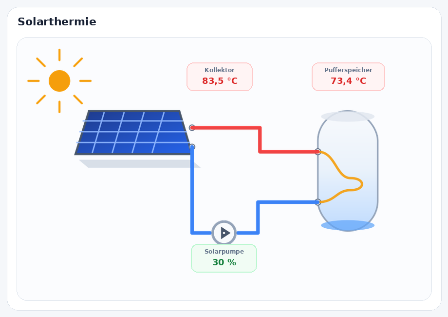
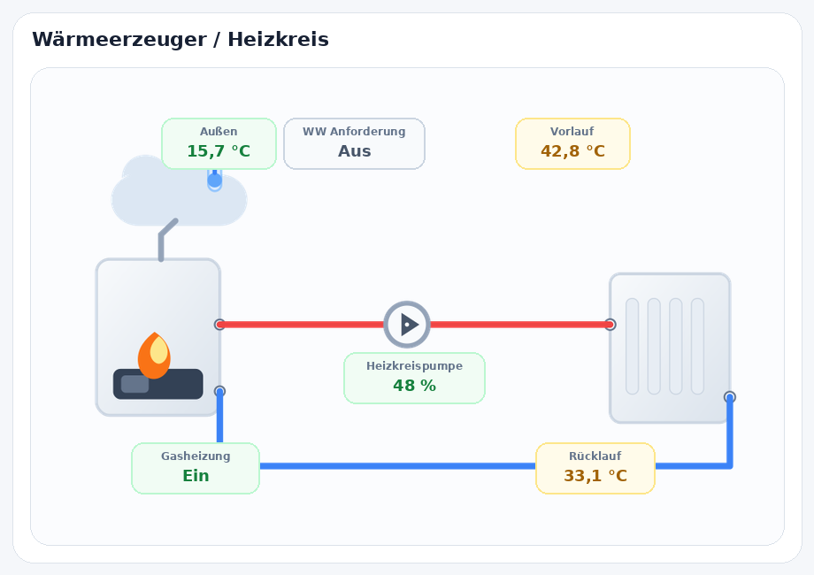
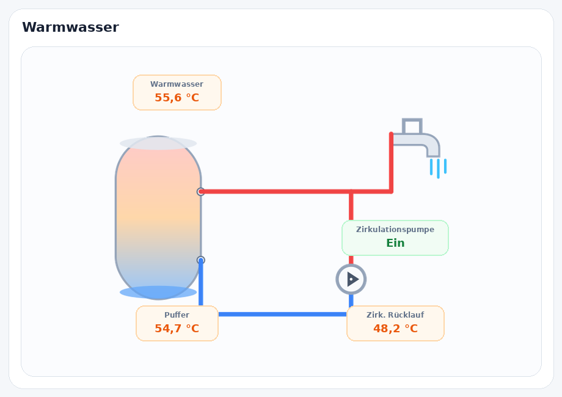

# Pengu Heat Card


A visual heating-system card for **Home Assistant** with logical heating circuits, a full GUI editor, clickable entities and configurable layouts.

Pengu Heat Card is designed for **Technische Alternative CMI / TA C.M.I.**, **UVR** installations and other heating controllers exposed to Home Assistant through **eBUS**, **Modbus**, **MQTT**, **ESPHome**, REST, template sensors or custom integrations.

Repository: `https://github.com/Borderlane-HA/Pengu-Heat-Card`

> For HACS, use the repository URL without `/tree/main`.

---

## Screenshots

| Solar thermal | Heat source / heating circuit | Domestic hot water |
| --- | --- | --- |
|  |  |  |

---

## Highlights

- ✅ Appears in **Add card → Pengu Heat Card**
- ✅ **Live card preview** in the Home Assistant card picker
- ✅ Full **GUI editor** — YAML is optional
- ✅ German and English labels
- ✅ Three focused diagram types:
  - Solar thermal
  - Heat source / heating circuit
  - Domestic hot water
- ✅ Heat source selection:
  - Gas boiler
  - Heat pump
  - Pellet boiler
  - District heating
- ✅ Logical closed-loop pipe layouts
- ✅ Reusable, consistent tank / storage graphics
- ✅ Real circulation-pump symbol in the domestic-hot-water loop
- ✅ Optional **Off / Subtle / Normal** flow animations
- ✅ Three visual presets: **Clean modern / Technical / Compact**
- ✅ Per-diagram visibility controls
- ✅ Custom labels
- ✅ **Drag & drop label positioning**
- ✅ Reset button for label positions
- ✅ Unconfigured entities are hidden automatically
- ✅ Click value labels **or equipment graphics** to open Home Assistant **More info / history**
- ✅ Tap action can be disabled
- ✅ HACS-compatible repository structure
- ✅ Entity-aware card suggestions on Home Assistant 2026.6+

---

## What's new in v2.0.1

- Fixed the README hero banner so the subtitle no longer gets clipped on GitHub.
- Improved the banner aspect ratio for desktop and mobile README layouts.

---

## What's new in v2.0.0

Version 2.0.0 is a visual and structural redesign.

### Solar thermal

The solar diagram now uses a real closed circuit:

**Collector → storage heat exchanger → solar pump → collector**

There are no open pipe ends. The flow and return connect directly to the collector and to the storage heat exchanger.

### Heat source + heating circuit

The former **Heating circuit** and **Standalone heat source** diagrams have been merged into one diagram.

The new view shows a complete heating loop:

**Heat source → heating pump → radiator / heating circuit → return → heat source**

The heat source icon is selected through the GUI editor. Maintenance/service has been removed from the card.

Domestic-hot-water demand can optionally be shown here because the demand belongs logically to the heat source rather than to the water tap.

### Domestic hot water

The domestic-hot-water diagram now shows:

- storage tank
- hot-water outlet
- consumer / tap
- circulation loop
- visible circulation pump
- circulation return

The old DHW-demand indicator has been removed from this diagram.

---

## Supported systems

Pengu Heat Card does not depend on one specific integration. If your heating controller exposes entities to Home Assistant, they can be mapped in the editor.

Typical systems include:

- Technische Alternative **CMI / TA C.M.I.**
- **UVR16x2 / UVR1611 / UVR610 / CAN-EZ / CAN-MTx** installations
- Solar thermal systems
- Gas boilers
- Heat pumps
- Pellet boilers
- District heating / Fernwärme
- Buffer tanks and domestic-hot-water storage
- eBUS heating systems
- Modbus heating controllers
- MQTT sensors
- ESPHome sensors
- REST and template sensors

---

## Installation

### HACS custom repository

1. Open **HACS** in Home Assistant.
2. Open the three-dot menu.
3. Choose **Custom repositories**.
4. Add:

   ```text
   https://github.com/Borderlane-HA/Pengu-Heat-Card
   ```

5. Category: **Dashboard**.
6. Install **Pengu Heat Card**.
7. Reload the browser if necessary.

### Manual installation

Copy `pengu-heat-card.js` to:

```text
/config/www/pengu-heat-card.js
```

Then add the resource:

```yaml
url: /local/pengu-heat-card.js
type: module
```

---

## Add the card

Open a dashboard and choose:

**Add card → Pengu Heat Card**

The card is registered with Home Assistant's custom-card picker and enables a live preview.

Available diagrams:

- **Solar thermal**
- **Heat source / heating circuit**
- **Domestic hot water**

---

## GUI editor

### General

The GUI editor lets you configure:

- Diagram type
- Title
- Language
- Heat source type
- Entities
- Visual style
- Animation mode
- Tap action
- Visible values
- Custom labels
- Drag-and-drop label positions

### Visual styles

Three presets are included:

- **Clean modern** — default rounded Home Assistant style
- **Technical** — flatter, more schematic appearance
- **Compact** — reduced spacing for smaller dashboard layouts

### Flow animation

```text
Off
Subtle
Normal
```

**Subtle** is the default. It keeps the pipes clean and only gently changes the active-flow emphasis.

`Normal` adds a slow moving dash pattern. No arrows are used.

### Clickable entities

Configured value labels and major equipment graphics are clickable by default.

Clicking them opens the Home Assistant **More info** dialog, including history when Home Assistant has history for that entity.

The tap action can also be set to **None**.

### Drag & drop label positions

The editor contains a **Label positions** panel.

Drag a label to the preferred location. Positions are stored as percentages, for example:

```yaml
label_collector_x: 49
label_collector_y: 15
```

A **Reset label positions** button restores the default layout.

### Empty entities

If an entity is not selected, its value label is not rendered. The dashboard does not show `Not configured` placeholders.

---

## Diagram configuration

### Solar thermal

Typical entities:

- Collector temperature
- Solar pump / pump speed
- Solar storage temperature

Example:

```yaml
type: custom:pengu-heat-card
diagram: solar_thermal
title: Solarthermie
language: de
collector_entity: sensor.kollektor_temp
pump_entity: sensor.solar_pumpe
storage_entity: sensor.pufferspeicher_solar
visual_style: modern
animation_mode: subtle
tap_action: more-info
show_solar_pump: true
label_collector: Kollektor
label_solar_pump: Solarpumpe
label_solar_storage: Pufferspeicher
```

### Heat source / heating circuit

Typical entities:

- Outdoor temperature
- Flow temperature
- Return temperature
- Heating pump / pump speed
- Heat source status
- Optional domestic-hot-water demand

Heat source types:

```yaml
heat_source_type: gas
```

```yaml
heat_source_type: heat_pump
```

```yaml
heat_source_type: pellet
```

```yaml
heat_source_type: district_heating
```

Example:

```yaml
type: custom:pengu-heat-card
diagram: heat_source
title: Wärmeerzeuger / Heizkreis
language: de
heat_source_type: gas
outside_entity: sensor.aussentemperatur
flow_entity: sensor.hk1_vorlauf
return_entity: sensor.hk1_ruecklauf
pump_entity: sensor.hk1_pumpe
burner_entity: binary_sensor.brenneranforderung
dhw_demand_entity: binary_sensor.warmwasseranforderung
visual_style: modern
animation_mode: subtle
tap_action: more-info
show_outdoor: true
show_heating_pump: true
show_heat_source_status: true
show_return_temp: true
show_dhw_demand: true
label_heat_source: Gasheizung
label_heating_flow: Vorlauf
label_return_flow: Rücklauf
label_heating_pump: Heizkreispumpe
```

### Domestic hot water

Typical entities:

- Hot-water temperature
- Storage / buffer temperature
- Circulation pump
- Circulation-return temperature

Example:

```yaml
type: custom:pengu-heat-card
diagram: hot_water
title: Warmwasser
language: de
hot_water_entity: sensor.warmwasser_temp
buffer_entity: sensor.puffer_temp
circulation_pump_entity: switch.zirkulationspumpe
return_entity: sensor.zirkulation_ruecklauf
visual_style: modern
animation_mode: subtle
tap_action: more-info
show_circulation_pump: true
show_return_temp: true
label_hot_water_temp: Warmwasser
label_buffer: Puffer
label_circulation_pump: Zirkulationspumpe
label_circulation_return: Zirk. Rücklauf
```

---

## Migration from v1.x

The GUI now exposes only three diagram types.

Existing configurations using:

```yaml
diagram: heating_circuit
```

or:

```yaml
diagram: heat_source_only
```

are automatically normalized to the new combined:

```yaml
diagram: heat_source
```

Existing entity assignments such as flow, return, pump and heat-source status remain usable.

The old `service_entity` is no longer displayed. The old domestic-hot-water `demand_entity` is also no longer shown in the hot-water diagram. If you want to display domestic-hot-water demand, configure `dhw_demand_entity` in the **Heat source / heating circuit** diagram.

---

## Repository structure

```text
Pengu-Heat-Card/
├─ .github/
│  └─ workflows/
│     └─ validate.yml
├─ assets/
│  └─ pengu-logo.svg
├─ dist/
│  └─ pengu-heat-card.js
├─ screenshots/
│  ├─ solar-thermal.png
│  ├─ heat-source.png
│  └─ hot-water.png
├─ CHANGELOG.md
├─ hacs.json
├─ LICENSE
├─ package.json
├─ pengu-heat-card.js
└─ README.md
```

---

## HACS notes

The production card file is available in `dist/pengu-heat-card.js`. The repository also includes a HACS validation workflow using the `plugin` category (shown as **Dashboard** in the HACS UI).

---

## License

MIT
